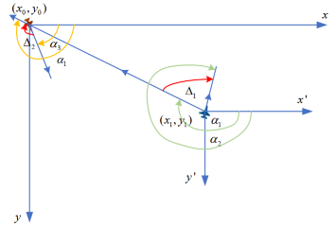

# 👨‍🎓 About	

**Dinghan Wang** is a 2nd-year master student in Control Science and Engineering at Northwestern Polytechnical University. My research interest includes: Deep Reinforcement Learning, Computer Vision, Intelligent Systems, UAV, Control Systems, Game Theory. 

Outside of my academic life, I am an aviation enthusiast and geek. I grew up in Harbin, a beautiful city in the northeast of China. 

Please find my **CV [here](../assets/Curriculum_Vitae.pdf)**.

**I am currently finding a PhD position suitable for me.**

# 🎓 Education

- *2022.09 - Present*, Northwestern Polytechnic University, MPhil, Control Science and Engineering, 1st/30
  - Dissertation: 
  - Scholarship: 
- *2018.09 - 2022.06*, Northwestern Polytechnic University, Bachelor, Detection guidance and control technology, 10th/65 (Conveyed)
  - Dissertation: Research on UAV Air Combat Decision-making Based on Hierarchical Reinforcement Learning
  - Scholarship: Scholarship from the School of Electronic Information (twice)

# 🎖 Outstanding Course Achievements

- Theoretical Mechanics 100/100
- Principle of automatic control I 100/100
- Computational Methods 100/100
- Fundamentals of Electric Circuits I 99/100
- C Programming Experiment(II) 97/100
- Higher Mathematics(2) 98/100
- Signal and System II 95/100
- Experiments for Analog Circuit Design 96/100
- Complex Function and Integral Transformation 96/100
- Equations and Special Functions in Mathematical Physics 97/100
- Fundamentals of Digital Electronics I 98/100
- Principle of Electronic Countermeasure 95/100
- Course Design of Exterior Aeroballistics 97/100
- Principle & Application of Microcomputer 96/100
- comprehensive experiment on detection guidance and control technology 96/100
- Graduation Design or Thesis “Research on UAV Air Combat Decision-making Based on Hierarchical Reinforcement Learning” 98/100
- Fundamentals of Analog Electronics(I) 90/100 (Top 10 in the school)

…….

Please click links to find my **complete [bachelor’s grades](../assets/Dinghan Wang_undergraduate transcripts.pdf) and [master’s grades](../assets/master grades.png)**.

# 🔥 News

- *2024.03*:  🎉🎉 My manuscript, “Loyal wingman task execution for future aerial combat: A hierarchical prior-based reinforcement learning approach”, has been accepted by Chinese Journal of Aeronautics.
- *2024.04*:  🎉🎉 My conference, “Dogfight Advantage Occupancy Method Based on Imperfect Information Self-play”, has been accepted by IEEE ICCA.
- *2023.07*:  🎉🎉 First Prize of Northwest Region of Graduate Student Electronic Design Competition (team leader).

# 📝 Publications

<table border="0">
    <tr>
        <td align="right" width="50%"></td>
        <td width="50%">Jiandong Zhang, <b>Dinghan Wang</b>, Qiming Yang*, Zhuoyong Shi, Longmeng Ji, Guoqing Shi, Yong Wu. 
      			 
<a href="https://doi.org/10.1016/j.cja.2024.03.009">Loyal wingman task execution for future aerial combat: A hierarchical prior-based reinforcement learning approach[J].</a> Chinese Journal of Aeronautics.
             
            (<b>co-first author, SCI JCR Q1 IF=5.7</b>)</td>
    </tr>
    <tr>
    	<td align="right" width="50%"></td>
        <td width="50%"><b>Dinghan Wang</b>, Longmeng Ji, Jingbo Wang, Zhuoyong Shi, Jiandong Zhang*, Qiming Yang, Guoqing Shi, Yong Wu, Yan Zhu, Jinwen Hu. 
      			 
<a href="">Dogfight Advantage Occupancy Method Based on Imperfect Information Self-play.</a> IEEE ICCA 2024.
             
            (<b>first author</b>)</td>
    </tr>
    <tr>
    	<td align="right" width="50%"></td>
        <td width="50%">Jiandong Zhang, <b>Dinghan Wang</b>, Qiming Yang*, Guoqing Shi, Yi Lu, Yaozhong Zhang. 
      			 
<a href="http://www.co-journal.com/CN/10.12382/bgxb.2022.0711">Multi-Dimensional Decision-Making for UAV Air Combat Based on Hierarchical Reinforcement Learning[J].</a> Acta Armamentarii.
             
            (<b>second author, EI</b>)</td>
    </tr>
    <tr>
    	<td align="right" width="50%"></td>
        <td width="50%"><b>Dinghan Wang</b>, Jiandong Zhang, Qiming Yang*, Jieling Liu, Guoqing Shi, Yaozhong Zhang. 
      			 
<a href="">An Autonomous Attack Decision-Making Method Based on Hierarchical Virtual Bayesian Reinforcement Learning[J].</a> IEEE Transactions on Aerospace and Electronic Systems.
             
            (<b>Peer rewiew stage. co-first author, SCI JCR Q1 IF=5.4</b>)</td>
    </tr>
    <tr>
    	<td align="right" width="50%"></td>
        <td width="50%">Xiaoyang Li, Teng Wang*, <b>Dinghan Wang*</b>, Hairuo Zhang, Ying Zhou, Deyun Zhou. 
      			 
<a href="">Intelligent Decision-Making Algorithm for Airborne Phased Array Radar Search Tasks Based on a Hierarchical Strategy Framework[J].</a> Chinese Journal of Aeronautics.
             
            (<b>Going to be accepted soon. co-correspondence author, SCI JCR Q1 IF=5.7</b>)</td>
    </tr>
</table>

# 🏅 Honors and Awards

- *2023.08*, National Graduate Student Electronic Design Competition Northwestern Regional First Prize, Team Award (Team Leader) 

- *2023.08*, National Graduate Student Electronic Design Competition (Business Track) Northwestern Regional Third Prize, Team Award

- *2022.07*, National College Students’ Innovation and Entrepreneurship Training Program Third Prize, Team Award (Team leader) 

- *2022.07*, Distinguished Graduate

- *2020 - 2021*, Outstanding Graduation Dissertation

- *2019 - 2021*, Scholarship from the School of Electronic Information (twice)

  **[Click here to view all my award certificates](../assets/certificates_combine.pdf)**

# 🔧 Skills

- Languages: Python, C, C++
- Frontend: HTML, CSS, JavaScript
- Clouds & Databases: MySQL, Tencent Cloud, Ali Cloud, Azure Cloud
- Web Technologies: Docker, NAT(v4&v6), Nginx, HTTP, SSL
- Operating Systems: Windows, Debian, Ubuntu, MacOS, OpenWRT, Proxmox VE
- Tools: PyTorch, OpenCV, OpenDDS, Git, Vim

# 💻 Video Demonstration

- [Loyal wingman task execution for future aerial combat: A hierarchical prior-based reinforcement learning approach](https://github.com/AI4IS/intelligent-aircraft-battle-game-sb3-jsbsim-flightgear)

<iframe width="560" height="315" src="https://www.youtube.com/embed/P9mMfpSGPnA?si=XjDbYYagHGp6aajH" title="YouTube video player" frameborder="0" allow="accelerometer; autoplay; clipboard-write; encrypted-media; gyroscope; picture-in-picture; web-share" referrerpolicy="strict-origin-when-cross-origin" allowfullscreen></iframe>

<iframe width="560" height="315" src="https://www.youtube.com/embed/Yg9QV8Y7KQU?si=bTg-CGvkXY4Nq8Gc" title="YouTube video player" frameborder="0" allow="accelerometer; autoplay; clipboard-write; encrypted-media; gyroscope; picture-in-picture; web-share" referrerpolicy="strict-origin-when-cross-origin" allowfullscreen></iframe>

- [Vision-based-Intelligent-Robot-Arm-Game](https://github.com/AI4IS/Vision-based-Intelligent-Robot-Arm-Game)

<iframe width="560" height="315" src="https://www.youtube.com/embed/lpzVwQIzMhM?si=gCzRhl840EarZswe" title="YouTube video player" frameborder="0" allow="accelerometer; autoplay; clipboard-write; encrypted-media; gyroscope; picture-in-picture; web-share" referrerpolicy="strict-origin-when-cross-origin" allowfullscreen></iframe>	

<iframe width="560" height="315" src="https://www.youtube.com/embed/U5HBWdTwz8k?si=6f4JkaIO0tUcbv7D" title="YouTube video player" frameborder="0" allow="accelerometer; autoplay; clipboard-write; encrypted-media; gyroscope; picture-in-picture; web-share" referrerpolicy="strict-origin-when-cross-origin" allowfullscreen></iframe>

<iframe width="560" height="315" src="https://www.youtube.com/embed/rpkPVAdVu0Y?si=hkFwFG7qKl1V4yQm" title="YouTube video player" frameborder="0" allow="accelerometer; autoplay; clipboard-write; encrypted-media; gyroscope; picture-in-picture; web-share" referrerpolicy="strict-origin-when-cross-origin" allowfullscreen></iframe>

- [Vision-based-Reinforcement-learning-control-for-aircraft](https://github.com/AI4IS/Vision-based-Reinforcement-learning-control-for-aircraft)

<iframe width="560" height="315" src="https://www.youtube.com/embed/Rn8_Yru5TRI?si=23J_ppIhCE5Z_UiD" title="YouTube video player" frameborder="0" allow="accelerometer; autoplay; clipboard-write; encrypted-media; gyroscope; picture-in-picture; web-share" referrerpolicy="strict-origin-when-cross-origin" allowfullscreen></iframe>

- [Multi-Dimensional-Decision-Making-for-UAV-Air-Combat-Based-on-Hierarchical-Reinforcement-Learning](https://github.com/AI4IS/Multi-Dimensional-Decision-Making-for-UAV-Air-Combat-Based-on-Hierarchical-Reinforcement-Learning)

<iframe width="560" height="315" src="https://www.youtube.com/embed/hYS2ae7KZPc?si=gRozgRmc2YW2enq_" title="YouTube video player" frameborder="0" allow="accelerometer; autoplay; clipboard-write; encrypted-media; gyroscope; picture-in-picture; web-share" referrerpolicy="strict-origin-when-cross-origin" allowfullscreen></iframe>

- Dogfight Advantage Occupancy Method Based on Imperfect Information Self-play

<iframe width="560" height="315" src="https://www.youtube.com/embed/mco0JyHWVXE?si=DIwJPWpopHlXov8v" title="YouTube video player" frameborder="0" allow="accelerometer; autoplay; clipboard-write; encrypted-media; gyroscope; picture-in-picture; web-share" referrerpolicy="strict-origin-when-cross-origin" allowfullscreen></iframe>

- An Autonomous Attack Decision-Making Method Based on Hierarchical Virtual Bayesian Reinforcement Learning

<iframe width="560" height="315" src="https://www.youtube.com/embed/6tTO4YMhLxA?si=i0cwbpSzFLbf9iuO" title="YouTube video player" frameborder="0" allow="accelerometer; autoplay; clipboard-write; encrypted-media; gyroscope; picture-in-picture; web-share" referrerpolicy="strict-origin-when-cross-origin" allowfullscreen></iframe>

# 😃 Open Source Projects

- [Vision-based-Intelligent-Robot-Arm-Game](https://github.com/AI4IS/Vision-based-Intelligent-Robot-Arm-Game)
- [Intelligent-aircraft-battle-game-sb3-jsbsim-flightgear](https://github.com/AI4IS/intelligent-aircraft-battle-game-sb3-jsbsim-flightgear)
- [Vision-based-Reinforcement-learning-control-for-aircraft](https://github.com/AI4IS/Vision-based-Reinforcement-learning-control-for-aircraft)
- [Multi-Dimensional-Decision-Making-for-UAV-Air-Combat-Based-on-Hierarchical-Reinforcement-Learning](https://github.com/AI4IS/Multi-Dimensional-Decision-Making-for-UAV-Air-Combat-Based-on-Hierarchical-Reinforcement-Learning)

