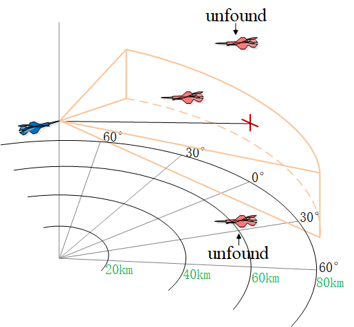

# 👨‍🎓 About	

**Dinghan Wang** is a 2nd-year master student in Control Science and Engineering at Northwestern Polytechnical University. My research interest includes: Deep Reinforcement Learning, Computer Vision, Intelligent Systems, UAV, Robotics, Control Systems, Game Theory. 

Outside of my academic life, I am an aviation enthusiast and geek. I was born in June 5th, 2000 in Harbin, a beautiful city in the northeast of China. 

You can find my **CV [here](../assets/Curriculum_Vitae.pdf)**.
Research demonstrations are shown in my **[Youtube channel](https://www.youtube.com/channel/UCJMRNVZrN_c_avI2IKq3GjA)**.

**I am currently finding a PhD position suitable for me.**

# 🎓 Education

- *2022.09 - Present*, Northwestern Polytechnic University, MPhil, Control Science and Engineering
  - Dissertation: To be determined
  - Scholarship: To be determined
- *2018.09 - 2022.06*, Northwestern Polytechnic University, Bachelor, Detection guidance and control technology, 10th/65 (Conveyed)
  - Dissertation: Research on UAV Air Combat Decision-making Based on Hierarchical Reinforcement Learning
  - Scholarship: Scholarship from the School of Electronic Information (twice)

# 🎖 Outstanding Course Achievements

<table border="0">
    <tr>
        <td width="50%">Theoretical Mechanics <i>100/100</i></td>
        <td width="50%">Principle of automatic control (I) <i>100/100</i></td>
    </tr>
    <tr>
        <td width="50%">Computational Methods <i>100/100</i></td>
        <td width="50%">Fundamentals of Electric Circuits (I) <i>99/100</i></td>
    </tr>
    <tr>
        <td width="50%">C Programming Experiment (II) <i>97/100</i></td>
        <td width="50%">Higher Mathematics (II) <i>98/100</i></td>
    </tr>
    <tr>
        <td width="50%">Signal and System <i>97/100</i></td>
        <td width="50%">Higher Mathematics (II) <i>98/100</i></td>
    </tr>
    <tr>
        <td width="50%">Signal and System (II) <i>95/100</i></td>
        <td width="50%">Experiments for Analog Circuit Design <i>96/100</i></td>
    </tr>
    <tr>
        <td width="50%">Complex Function and Integral Transformation <i>96/100</i></td>
        <td width="50%">Equations and Special Functions in Mathematical Physics <i>97/100</i></td>
    </tr>
    <tr>
        <td width="50%">Fundamentals of Digital Electronics (I) <i>98/100</i></td>
        <td width="50%">Principle of Electronic Countermeasure <i>95/100</i></td>
    </tr>
    <tr>
        <td width="50%">Course Design of Exterior Aeroballistics <i>97/100</i></td>
        <td width="50%">Principle & Application of Microcomputer <i>96/100</i></td>
    </tr>
    <tr>
        <td width="50%">Comprehensive experiment on detection guidance and control technology <i>96/100</i></td>
        <td width="50%">Principle & Application of Microcomputer <i>96/100</i></td>
    </tr>
    <tr>
        <td width="50%">Graduation Design or Thesis “Research on UAV Air Combat Decision-making Based on Hierarchical Reinforcement Learning” <i>98/100</i></td>
        <td width="50%">Fundamentals of Analog Electronics (I) <i>90/100 (Top 10 in the school)</i></td>
    </tr>
</table>

Please click links to find my **complete [bachelor’s grades](../assets/Dinghan Wang_undergraduate transcripts.pdf) and [master’s grades](../assets/master grades.png)**.

# 🔥 News
- *2024.06*:  🎉🎉 Our manuscript, “An Autonomous Attack Decision-Making Method Based on Hierarchical Virtual Bayesian Reinforcement Learning” has been aaccepted by IEEE Transactions on Aerospace and Electronic Systems.
- *2024.05*:  **I'm going to open source a low-cost plan (400$) to build up an autonomous obstacle avoidance drone.**
- *2024.04*:  🎉🎉 Our manuscript, “Intelligent Decision-Making Algorithm for Airborne Phased Array Radar Search Tasks Based on a Hierarchical Strategy Framework”, has been initially accepted by Chinese Journal of Aeronautics.
- *2024.04*:  🎉🎉 Our manuscript, “Design of UAV Flight State Recognition System for Multi-sensor Data Fusion”, has been initially accepted by IEEE Sensors Journal.
- *2024.04*:  🎉🎉 Our conference, “Dogfight Advantage Occupancy Method Based on Imperfect Information Self-play”, has been accepted by IEEE ICCA. Looking forward to sharing our results in Iceland in June.
- *2024.03*:  🎉🎉 Our manuscript, “Loyal wingman task execution for future aerial combat: A hierarchical prior-based reinforcement learning approach”, has been totally accepted by Chinese Journal of Aeronautics and you can find it online.
- *2024.01*:  🎉🎉 Our manuscript, “Design of motor skill recognition and hierarchical evaluation system for table tennis players”, has been published by IEEE Sensors Journal.
- *2023.11*:  🎉🎉 It is a pleasure to be a reviewer of IEEE Sensors Journal.
- *2023.10*:  🎉🎉 Our conference, “Design of motion pattern recognition system based on artificial intelligence methods”, has been published by IEEE ICCSI.
- *2023.09*:  🎉🎉 Our conference, “Autonomous Security Evaluation Model for UAV Based on Airborne Information”, has been published by IEEE ICICSP.
- *2023.07*:  🎉🎉 I get First Prize of Northwest Region of Graduate Student Electronic Design Competition (team leader).

# 📝 Publications

<table border="0">
    <tr>
<!--         <td align="right" width="50%"></td> -->
        <td width="50%">Jiandong Zhang, <b>Dinghan Wang</b>, Qiming Yang*, Zhuoyong Shi, Longmeng Ji, Guoqing Shi, Yong Wu. 
      			 
<a href="../assets/cjap1.pdf">Loyal wingman task execution for future aerial combat: A hierarchical prior-based reinforcement learning approach[J].</a>
             
            Chinese Journal of Aeronautics.
             
            (<b>co-first author, SCI JCR Q1</b>)</td>
    </tr>
    <tr>
<!--     	  <td align="right" width="50%"></td> -->
        <td width="50%">Xiaoyang Li, Teng Wang*, <b>Dinghan Wang*</b>, Hairuo Zhang, Ying Zhou, Deyun Zhou. 
      			 
<a href="../assets/cjap2.pdf">Intelligent Decision-Making Algorithm for Airborne Phased Array Radar Search Tasks Based on a Hierarchical Strategy Framework[J].</a> 
             
            Chinese Journal of Aeronautics.
             
            (<b>Initial accept. co-correspondence author, SCI JCR Q1</b>)</td>
    </tr>
    <tr>
<!--     	  <td align="right" width="50%"></td> -->
        <td width="50%"><b>Dinghan Wang</b>, Longmeng Ji, Jingbo Wang, Zhuoyong Shi, Jiandong Zhang*, Qiming Yang, Guoqing Shi, Yong Wu, Yan Zhu, Jinwen Hu. 
      			 
<a href="../assets/iccap3.pdf">Dogfight Advantage Occupancy Method Based on Imperfect Information Self-play[C].</a> 
             
            IEEE ICCA 2024.
             
            (<b>first author</b>)</td>
    </tr>
    <tr>
<!--     	  <td align="right" width="50%"></td> -->
        <td width="50%"><b>Dinghan Wang</b>, Jiandong Zhang, Qiming Yang*, Jieling Liu, Guoqing Shi, Yaozhong Zhang. 
      			 
<a href="">An Autonomous Attack Decision-Making Method Based on Hierarchical Virtual Bayesian Reinforcement Learning[J].</a> 
             
            IEEE Transactions on Aerospace and Electronic Systems.
             
            (<b>Major Revision. co-first author, SCI JCR Q1 TOP</b>)</td>
    </tr>
    <tr>
<!--     	  <td align="right" width="50%"></td> -->
        <td width="50%">Zhuoyong Shi, Yetao Jia, Yong Wu, Kexin Zhang, Longmeng Ji, <b>Dinghan Wang</b>. 
      			 
<a href="../assets/sj1.pdf">Design of motor skill recognition and hierarchical evaluation system for table tennis players[J].</a> 
             
            IEEE Sensors Journal.
             
            (<b>SCI JCR Q1</b>)</td>
    </tr>
    <tr>
<!--     	<td align="right" width="50%"></td> -->
        <td width="50%">Zhuoyong Shi, Guoqing Shi, Jiandong Zhang, <b>Dinghan Wang</b>, Tianyue Xu, Longmeng Ji, Yong Wu. 
      			 
<a href="../assets/sj2.pdf">Design of UAV Flight State Recognition System for Multi-sensor Data Fusion[J].</a> 
             
            IEEE Sensors Journal.
             
            (<b>SCI JCR Q1</b>)</td>
    </tr>
    <tr>
<!--     	  <td align="right" width="50%"></td> -->
        <td width="50%">Zhuoyong Shi, Liuming Yang, Yong Wu, <b>Dinghan Wang</b>, JianDong Zhang, Anli Zhang. 
      			 
<a href="../assets/iccsi.pdf">Design of motion pattern recognition system based on artificial intelligence methods[C].</a> 
             
            IEEE ICCSI.
        </td>
    </tr>
    <tr>
<!--     	<td align="right" width="50%"></td> -->
        <td width="50%">Zhuoyong Shi, Mingyang Liu, Qiming Yang, Jieling Liu, <b>Dinghan Wang</b>, Jiandong Zhang. 
      			 
<a href="../assets/icicsp.pdf">Autonomous Security Evaluation Model for UAV Based on Airborne Information[C].</a> 
             
            IEEE ICICSP.
        </td>
    </tr>  
</table>

# 🏅 Honors and Awards

- *2023.08*, National Graduate Student Electronic Design Competition Northwestern Regional First Prize, Team Award (Team Leader) 

- *2023.08*, National Graduate Student Electronic Design Competition (Business Track) Northwestern Regional Third Prize, Team Award

- *2022.07*, National College Students’ Innovation and Entrepreneurship Training Program Third Prize, Team Award (Team leader) 

- *2022.07*, Distinguished Graduate

- *2020 - 2021*, Outstanding Graduation Dissertation

- *2019 - 2021*, Scholarship from the School of Electronic Information (twice)

  **[Click here to view all my award certificates](../assets/certificates_combine.pdf)**

# 🔧 Skills

- Languages: Python, C, C++
- Frontend: HTML, CSS, JavaScript
- Clouds & Databases: MySQL, Tencent Cloud, Ali Cloud, Azure Cloud
- Web Technologies: Docker, NAT(v4&v6), Nginx, HTTP, SSL
- Operating Systems: Windows, Debian, Ubuntu, MacOS, OpenWRT, Proxmox VE
- Tools: PyTorch, OpenCV, OpenDDS, Git, Vim

# 😃 Open Source Projects

- [Vision-based-Intelligent-Robot-Arm-Game](https://github.com/AI4IS/Vision-based-Intelligent-Robot-Arm-Game)
- [Intelligent-aircraft-battle-game-sb3-jsbsim-flightgear](https://github.com/AI4IS/intelligent-aircraft-battle-game-sb3-jsbsim-flightgear)
- [Vision-based-Reinforcement-learning-control-for-aircraft](https://github.com/AI4IS/Vision-based-Reinforcement-learning-control-for-aircraft)
- [Multi-Dimensional-Decision-Making-for-UAV-Air-Combat-Based-on-Hierarchical-Reinforcement-Learning](https://github.com/AI4IS/Multi-Dimensional-Decision-Making-for-UAV-Air-Combat-Based-on-Hierarchical-Reinforcement-Learning)

# Research gallery

<table border="0">
    <tr>
    	  <td align="right" width="50%"></td>
        <td align="right" width="50%"></td>
    </tr>
    <tr>
        <td align="right" width="50%"></td>
        <td align="right" width="50%"></td>
    </tr>
    <tr>
        <td align="right" width="50%"></td>
        <td align="right" width="50%"></td>
    </tr>
    <tr>
        <td align="right" width="50%"></td>
        <td align="right" width="50%"></td>
    </tr>
    <tr>
        <td align="right" width="50%"></td>
        <td align="right" width="50%"></td>
    </tr>
    <tr>
        <td align="right" width="50%"></td>
    </tr>
  
</table>

You can find more video demostration [here](https://www.youtube.com/channel/UCJMRNVZrN_c_avI2IKq3GjA).

