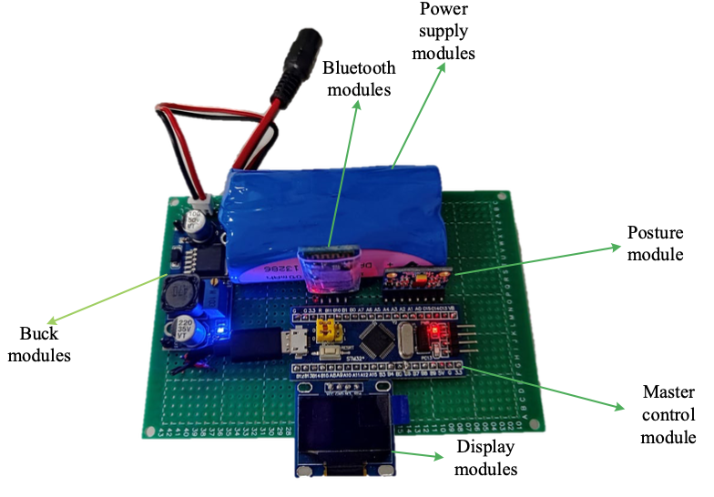
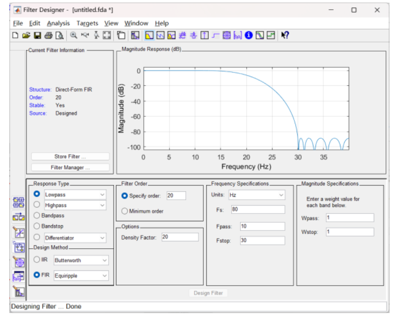
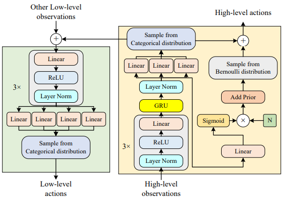



# 👨‍🎓 简介	

**王鼎涵** 是西北工业大学控制科学与工程专业二年级硕士生。我的研究兴趣包括：深度强化学习、计算机视觉、智能系统、无人机、机器人、控制系统、博弈论。 

在学术生活之外，我是一名航空爱好者和极客。我于2000年6月5日出生在中国东北一个美丽的城市哈尔滨。

您可以在[这里](../assets/Curriculum_Vitae.pdf)找到我的**简历**。
**研究演示**在我的[YouTube 频道](https://www.youtube.com/channel/UCJMRNVZrN_c_avI2IKq3GjA)上展示。

**我目前正在寻找适合我的博士职位。**

# 🎓 教育经历

- *2022.09 - 至今*，西北工业大学，硕士，控制科学与工程
  - 论文：待定
  - 奖学金：待定
- *2018.09 - 2022.06*, 西北工业大学, 学士, 探测制导与控制技术, 10th/65
  - 论文：基于分层强化学习的无人机空战决策研究
  - 奖学金：电子信息学院奖学金（两次）

# 🎖 优异的课程成绩

<table border="0">
    <tr>
        <td width="50%">理论力学 <i>100/100</i></td>
        <td width="50%">自动控制原理（一） <i>100/100</i></td>
    </tr>
    <tr>
        <td width="50%">计算方法 <i>100/100</i></td>
        <td width="50%">电路基础（一） <i>99/100</i></td>
    </tr>
    <tr>
        <td width="50%">C编程实验（二） <i>97/100</i></td>
        <td width="50%">高等数学（二） <i>98/100</i></td>
    </tr>
    <tr>
        <td width="50%">信号与系统 <i>97/100</i></td>
        <td width="50%">探测制导与控制技术综合实验 <i>96/100</i></td>
    </tr>
    <tr>
        <td width="50%">信号与系统（二） <i>95/100</i></td>
        <td width="50%">模拟电路设计实验 <i>96/100</i></td>
    </tr>
    <tr>
        <td width="50%">复函数与积分变换 <i>96/100</i></td>
        <td width="50%">数学物理中的方程和特殊函数 <i>97/100</i></td>
    </tr>
    <tr>
        <td width="50%">数字电子学基础（一） <i>98/100</i></td>
        <td width="50%">电子对抗原理 <i>95/100</i></td>
    </tr>
    <tr>
        <td width="50%">航空外弹道课程设计 <i>97/100</i></td>
        <td width="50%">微机原理及应用 <i>96/100</i></td>
    </tr>
    <tr>
        <td width="50%">毕业设计论文《基于分层强化学习的无人机空战决策研究》 <i>98/100</i></td>
        <td width="50%">模拟电子基础（一） <i>90/100 (校内前10名)</i></td>
    </tr>
</table>

请点击链接查找我完整的[学士成绩](../assets/Dinghan Wang_undergraduate transcripts.pdf)和[硕士学位成绩](../assets/master grades.png)。

# 🔥 新闻
- *2024.06*:  🎉🎉 我们的论文“An Autonomous Attack Decision-Making Method Based on Hierarchical Virtual Bayesian Reinforcement Learning”已被IEEE Transactions on Aerospace and Electronic Systems接收。
- *2024.05*:  我将开源一个低成本计划（2800 人民币）来构建自主避障无人机。
- *2024.04*:  🎉🎉 我们的论文《ntelligent Decision-Making Algorithm for Airborne Phased Array Radar Search Tasks Based on a Hierarchical Strategy Framework》已被《航空学报英文版》初步接收。
- *2024.04*:  🎉🎉 我们的论文《Design of UAV Flight State Recognition System for Multi-sensor Data Fusion》已被IEEE Sensors Journal初步接收。
- *2024.04*:  🎉🎉 我们的会议“Dogfight Advantage Occupancy Method Based on Imperfect Information Self-play”已被IEEE ICCA接收。期待分享我们六月在冰岛的成果。
- *2024.03*:  🎉🎉 我们的论文, “Loyal wingman task execution for future aerial combat: A hierarchical prior-based reinforcement learning approach”已被《航空学报英文版》完全接收，您可以在网上找到它。
- *2024.01*:  🎉🎉 我们的论文 “Design of motor skill recognition and hierarchical evaluation system for table tennis players”已在 IEEE Sensors Journal 发表。
- *2023.11*:  🎉🎉 很高兴成为 IEEE Sensors Journal 的审稿人。
- *2023.10*:  🎉🎉 我们的会议 “Design of motion pattern recognition system based on artificial intelligence methods”已由IEEE ICCSI 发表。
- *2023.09*:  🎉🎉 我们的会议 “Autonomous Security Evaluation Model for UAV Based on Airborne Information”已由IEEE IICSP出版。
- *2023.07*:  🎉🎉 获得研究生电子设计大赛西北赛区一等奖（队长）。

# 📝 论文发表

<table border="0">
  <tr>
<!--     	  <td align="right" width="50%"></td> -->
        <td width="50%"><b>Dinghan Wang</b>, Jiandong Zhang, Qiming Yang*, Jieling Liu, Guoqing Shi, Yaozhong Zhang. 
      			 
<a href="https://ieeexplore.ieee.org/document/10551427">An Autonomous Attack Decision-Making Method Based on Hierarchical Virtual Bayesian Reinforcement Learning[J].</a> 
             
            IEEE Transactions on Aerospace and Electronic Systems.
             
            (SCI JCR Q1) DOI: 10.1109/TAES.2024.3410249</td>
    </tr>
  <tr>
<!--     	  <td align="right" width="50%"></td> -->
        <td width="50%"><b>Dinghan Wang</b>, Longmeng Ji, Jingbo Wang, Zhuoyong Shi, Jiandong Zhang*, Qiming Yang, Guoqing Shi, Yong Wu, Yan Zhu, Jinwen Hu. 
      			 
<a href="https://ieeexplore.ieee.org/abstract/document/10591896">Dogfight Advantage Occupancy Method Based on Imperfect Information Self-play[C].</a> 
             
            2024 IEEE International Conference on Control & Automation (ICCA).
             
            </td>
    </tr>
    <tr>
<!--         <td align="right" width="50%"></td> -->
        <td width="50%">Jiandong Zhang, <b>Dinghan Wang</b>, Qiming Yang*, Zhuoyong Shi, Longmeng Ji, Guoqing Shi, Yong Wu. 
      			 
<a href="https://doi.org/10.1016/j.cja.2024.03.009">Loyal wingman task execution for future aerial combat: A hierarchical prior-based reinforcement learning approach[J].</a>
             
            Chinese Journal of Aeronautics.
             
            (Co-first author, SCI JCR Q1) DOI: 10.1016/j.cja.2024.03.009</td>
    </tr>
    <tr>
<!--     	  <td align="right" width="50%"></td> -->
        <td width="50%">Xiaoyang Li, Teng Wang*, <b>Dinghan Wang*</b>, Hairuo Zhang, Ying Zhou, Deyun Zhou. 
      			 
<a href="../assets/cjap2.pdf">Intelligent Decision-Making Algorithm for Airborne Phased Array Radar Search Tasks Based on a Hierarchical Strategy Framework[J].</a> 
             
            Chinese Journal of Aeronautics.
             
            (Waiting online, co-correspondence author, SCI JCR Q1)</td>
    </tr>
    <tr>
<!--     	  <td align="right" width="50%"></td> -->
        <td width="50%">Zhuoyong Shi, Yetao Jia, Yong Wu, Kexin Zhang, Longmeng Ji, <b>Dinghan Wang</b>. 
      			 
<a href="../assets/sj1.pdf">Design of motor skill recognition and hierarchical evaluation system for table tennis players[J].</a> 
             
            IEEE Sensors Journal.
             
            (SCI JCR Q1) DOI: 10.1109/JSEN.2023.3346880</td>
    </tr>
    <tr>
<!--     	<td align="right" width="50%"></td> -->
        <td width="50%">Zhuoyong Shi, Guoqing Shi, Jiandong Zhang, <b>Dinghan Wang</b>, Tianyue Xu, Longmeng Ji, Yong Wu. 
      			 
<a href="../assets/sj2.pdf">Design of UAV Flight State Recognition System for Multi-sensor Data Fusion[J].</a> 
             
            IEEE Sensors Journal.
             
            (SCI JCR Q1) DOI: 10.1109/JSEN.2024.3394883</td>
    </tr>
    <tr>
<!--     	  <td align="right" width="50%"></td> -->
        <td width="50%">Zhuoyong Shi, Liuming Yang, Yong Wu, <b>Dinghan Wang</b>, JianDong Zhang, Anli Zhang. 
      			 
<a href="../assets/iccsi.pdf">Design of motion pattern recognition system based on artificial intelligence methods[C].</a> 
             
            2023 IEEE International Conference on Cyber-physical Social Intelligence.
           
          DOI: 10.1109/ICCSI58851.2023.10303805
        </td>
    </tr>
    <tr>
<!--     	<td align="right" width="50%"></td> -->
        <td width="50%">Zhuoyong Shi, Mingyang Liu, Qiming Yang, Jieling Liu, <b>Dinghan Wang</b>, Jiandong Zhang. 
      			 
<a href="../assets/icicsp.pdf">Autonomous Security Evaluation Model for UAV Based on Airborne Information[C].</a> 
             
            2023 IEEE International Conference on Information Communication and Signal Processing.
           
          DOI: 10.1109/ICICSP59554.2023.10390620
        </td>
    </tr>  
</table>

# 🏅 荣誉和奖项

- *2024.08*, 全国研究生电子设计大赛西北赛区二等奖，团队奖（队长）（队长） 
- *2023.11*, Mathorcup高校数模挑战赛——大数据竞赛三等奖，团队奖（队长） 
- *2023.08*, 全国研究生电子设计大赛西北赛区一等奖，团队奖（队长） 
- *2023.08*, 全国研究生电子设计大赛（商业赛道）西北赛区三等奖，团体奖
- *2022.07*, 全国大学生创新创业训练计划三等奖，团队奖（团队负责人） 
- *2022.07*, 优秀毕业生
- *2020 - 2021*, 优秀毕业论文

  **[点击这里查看所有获奖证书](../assets/certificates_combine.pdf)**

# 🔧 技能

- 编程语言: Python, C, C++
- 前端: HTML, CSS, JavaScript
- 云 & 数据库: MySQL, Tencent Cloud, Ali Cloud, Azure Cloud
- 网络技术: Docker, NAT(v4&v6), Nginx, HTTP, SSL
- 操作系统: Windows, Debian, Ubuntu, MacOS, OpenWRT, Proxmox VE
- 工具: PyTorch, OpenCV, OpenDDS, Git, Vim, ROS, LATEX

# 💻 开源项目

- [Vision-based-Intelligent-Robot-Arm-Game](https://github.com/AI4IS/Vision-based-Intelligent-Robot-Arm-Game)
- [Intelligent-aircraft-battle-game-sb3-jsbsim-flightgear](https://github.com/AI4IS/intelligent-aircraft-battle-game-sb3-jsbsim-flightgear)
- [Vision-based-Reinforcement-learning-control-for-aircraft](https://github.com/AI4IS/Vision-based-Reinforcement-learning-control-for-aircraft)
- [Multi-Dimensional-Decision-Making-for-UAV-Air-Combat-Based-on-Hierarchical-Reinforcement-Learning](https://github.com/AI4IS/Multi-Dimensional-Decision-Making-for-UAV-Air-Combat-Based-on-Hierarchical-Reinforcement-Learning)
- [Stablebaselines3_quad_s2r](https://github.com/AI4IS/stablebaselines3_quad_s2r)

# 🖼 研究画廊

<table border="0">
    <tr>
    	  <td align="right" width="50%"></td>
        <td align="right" width="50%"></td>
    </tr>
    <tr>
        <td align="right" width="50%"></td>
        <td align="right" width="50%"></td>
    </tr>
</table>

